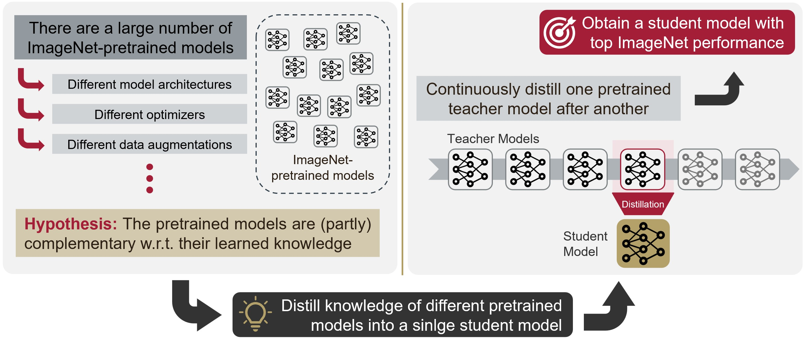

# Continual Distillation

In recent years a large number of ImageNet-pretrained deep learning models for image classification have become available online. These models are of different architectures, and are trained using different optimizers, augmentation, and training strategies.
Therefore we hypothesize these pretrained models to have learned at least partly complementary knowledge about the ImageNet dataset.

In this project we aim to leverage complementarity of the knowledge learned by the individual models by distilling knowledge from a large number of teacher models into a single student model.
Further, we aim to conduct the distillation continuously by sequentially distilling one teacher model in each distillation step.



The ultimate goal of this project is to obtain a student model with top ImageNet performance.

---
## Implemented Distillation Approaches
*Knowledge Distillation Approaches*
| Name      | Approach      | W&B Report |
| ------------- |---------|-----------|
|kl | KL-Divergence Distillation | [:clipboard:](https://api.wandb.ai/report/luth/wouuuku1)|
|xekl | KL-Div + Cross-Entropy Distillation | [:clipboard:](https://wandb.ai/luth/kl-dist-imagenet/reports/XE-KL-Distillation-Study--VmlldzozMzQyODIz?accessToken=6jeq4z7uksvcbevtb07i0unlwcw54krwwjxtxl2j8kbwgzjhj8wwfi84ggh40zed) [:clipboard:](https://api.wandb.ai/links/luth/v2thuisa) |
|hinton | Cross-Entropy between soft and hard targets [:page_facing_up:](https://arxiv.org/abs/1503.02531) | :x: |

*Contrastive Knowledge Distillation*
| Name      | Approach      | W&B Report |
| ------------- |---------|-----------|
|cd | Simple Contrastive Distillation | [:clipboard:](https://api.wandb.ai/links/luth/nqo1rjme) |
|crd | Contrastive Representation Distillation [:page_facing_up:](https://arxiv.org/abs/1503.02531) | [:clipboard:](https://wandb.ai/luth/crd-dist-imagenet/reports/Contrastive-Represenation-Distillation-Study--VmlldzozMzk0NjE3?accessToken=otkanajhn9dguo9by0xe3y2stl9hv2i7les4u4gqm11z6f4wtke8llq8bknvy7c3) |

*Auxiliary Approaches*
| Name      | Approach      | W&B Report |
| ------------- |---------|-----------|
|mcl | Momentum-based Weight Interpolation [:page_facing_up:](https://arxiv.org/abs/2211.03186) | [:clipboard:](https://api.wandb.ai/links/luth/6yv6q2xl)|
|sup | Supervised Knowledge Distillation | [:clipboard:](https://api.wandb.ai/links/luth/v2thuisa) [:clipboard:](https://api.wandb.ai/links/luth/on8viq6b)|
|mt  | Multi-Teacher Distillation | :x: |

---
## Requirements
* torch
* torchvision
* tqdm
* einops
* wandb
* pytorch-lightning
* lightning-bolts
* torchmetrics
* scipy
* timm

**Optional**:
* nvidia-dali
* matplotlib
* seaborn
* pandas
* umap-learn

---

## Installation

First clone the repo.

Then, to install solo-learn with [Dali](https://github.com/NVIDIA/DALI) and/or UMAP support, use:
```
pip3 install .[dali,umap,h5] --extra-index-url https://developer.download.nvidia.com/compute/redist
```

If no Dali/UMAP/H5 support is needed, the repository can be installed as:
```
pip3 install .
```

For local development:
```
pip3 install -e .[umap,h5]
# Make sure you have pre-commit hooks installed
pre-commit install
```

**NOTE:** if you are having trouble with dali, install it following their [guide](https://github.com/NVIDIA/DALI).

**NOTE 2:** consider installing [Pillow-SIMD](https://github.com/uploadcare/pillow-simd) for better loading times when not using Dali.

**NOTE 3:** Soon to be on pip.

---

## Training
Execute `dist_job.sh` to conduct knowledge distillation for one teacher-student pair.

Execute `contdist_job.sh` to conduct continual knowledge distillation for one student model and multiple teacher models.
