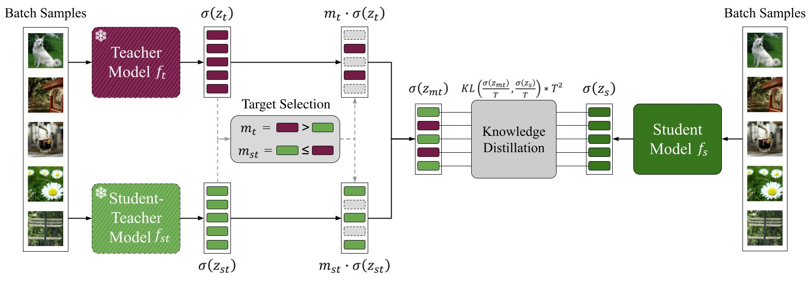

# Anyone can teach: Knowledge Transfer between Arbitrary Pretrained Models

Training deep models from scratch is a time-consuming task. Achieving additional gains after performance saturation is difficult without additional data or changes to the training protocol or model architecture.
Fortunately, the research community has aggregated ever-increasing collections of pretrained models on a range of canonical pretraining datasets varying across factors like architecture, optimization, and augmentations. As a consequence, each model extracts a unique understanding from the data source.
In this work, we explore how this unique understanding can serve as a teacher to impart complementary knowledge to any other model architecture trained on the same dataset - even if the teacher is much weaker in overall performance - and how model zoos can consequently offer large and freely available resources for additional performance improvements. 
In particular, across large-scale experimental studies, we investigate the limits and shortcomings of knowledge distillation to transfer such complementary knowledge between arbitrary pretrained models. 
We further propose extensions from the perspective of continual learning to significantly raise the success rate of effective knowledge transfer between arbitrary model pairs by more than double to nearly $100\%$. 
Finally, we provide additional insights into knowledge transfer from multiple models.



This repository contains all code to reproduce the results of our paper.

---
## Requirements
+ wandb~=0.13.7
+ pandas~=1.5.2
+ numpy~=1.23.5
+ matplotlib~=3.6.2
+ seaborn~=0.12.1
+ torch~=1.13.1
+ omegaconf~=2.3.0
+ timm~=0.6.12
+ wordcloud~=1.8.2.2
+ scipy~=1.9.3
+ ffcv~=0.0.3
+ tqdm~=4.64.1
+ sklearn~=0.0.post1
+ scikit-learn~=1.2.0
+ torchvision~=0.14.1
+ numba~=0.56.4
+ fastargs~=1.2.0

Install the requirements with `pip install -r requirements.txt`.

---
## Consistent Complementary Knowledge
We analyze the positive prediction flips between teacher and student models to identify complementary knowledge.

In detail, we assess the following aspects:
* Share of positive prediction flips between arbitrary pretrained teacher-student pairs
* Entropy of the positive prediction flips per class
* Similarity of the classes containing the largest share of positive prediction flips

To reproduce the results on the complementary knowledge, execute:
```
python main_flips.py --config-path scripts/prediction_flips --config-name flips.yaml
```

---
## Knowledge Transfer between Arbitrary Model Pairs
We conduct a large-scale experimental study to assess the limits and shortcomings of knowledge distillation to transfer complementary knowledge between arbitrary pretrained models.

### Implemented Distillation Approaches
*Vanilla Knowledge Distillation Variants*
| Name      | Approach      | Parameter Searches | ImageNet<sub>10%</sub> Study |
| ------------- |---------|-----------|-----------|
|kl | KL-Divergence Distillation | [:clipboard:](https://api.wandb.ai/links/luth/zly1xoys) | [:clipboard:](https://api.wandb.ai/links/luth/xf7t7vuo) |
|xekl | KL-Div + Cross-Entropy Distillation | [:clipboard:](https://api.wandb.ai/links/luth/rw7pgynj) [:clipboard:](https://api.wandb.ai/links/luth/y3p0ocpu) [:clipboard:](https://api.wandb.ai/links/luth/slu8k44k) [:clipboard:](https://api.wandb.ai/links/luth/hps8l6uv) | [:clipboard:](https://api.wandb.ai/links/luth/j1zgqoyr) |

*Contrastive Knowledge Distillation*
| Name      | Approach      | Parameter Searches | ImageNet<sub>10%</sub> Study |
| ------------- |---------|-----------|-----------|
|cd | Simple Contrastive Distillation | [:clipboard:](https://api.wandb.ai/links/luth/nqo1rjme) | [:clipboard:](https://api.wandb.ai/links/luth/s9pf6txx) |
|crd | Contrastive Representation Distillation [:page_facing_up:](https://arxiv.org/abs/1503.02531) | [:clipboard:](https://wandb.ai/luth/2-2_contrastive_distillation/reports/Contrastive-Represenation-Distillation-Approach--VmlldzozMzk0NjE3?accessToken=otkanajhn9dguo9by0xe3y2stl9hv2i7les4u4gqm11z6f4wtke8llq8bknvy7c3) | [:clipboard:](https://api.wandb.ai/links/luth/c4rar9pa) |

*Continual Learning Based Distillation Approaches*
| Name      | Approach      | Parameter Searches | ImageNet<sub>10%</sub> Study |
| ------------- |---------|-----------|-----------|
|xekl_mcl | Momentum-based Weight Interpolation [:page_facing_up:](https://arxiv.org/abs/2211.03186) | [:clipboard:](https://api.wandb.ai/links/luth/16rfkl0g) [:clipboard:](https://api.wandb.ai/links/luth/bi1f65zw) [:clipboard:](https://api.wandb.ai/links/luth/z8xhf7dr) | [:clipboard:](https://wandb.ai/luth/2_distill_between_experts/reports/5-XE-KL-MCL-Distillation-for-Distilling-Knowledge-Between-Experts--Vmlldzo0MDI5Mjk0?accessToken=dmllgtz6ncey8ljil30rvlca73bhdclp98bly8cz1p8kk8xxz5kw40iob06blawe) |
|kl_dp  | Data Partitioning Distillation | [:clipboard:](https://api.wandb.ai/links/luth/9jvdbrnt) [:clipboard:](https://api.wandb.ai/links/luth/vsino0vn) [:clipboard:](https://api.wandb.ai/links/luth/p2o6o0s9) | [:clipboard:](https://api.wandb.ai/links/luth/yndr09ii) [:clipboard:](https://api.wandb.ai/links/luth/l4jsbcj2) |

### Training
To reproduce the results on the knowledge transfer between arbitrary model pairs, execute:
``` 
python main_distillation.py --config-path scripts/distillation --config-name <approach>_dist.yaml
```
where `<approach>` is one of the approaches listed above.

## Knowledge Transfer between Multiple Models
We extend our proposed KL+DP distillation approach to transfer knowledge from multiple teacher models to a single student model.

For this porpose we assess three different approaches, sequential distillation, parallel distillation and a _Model Soups_ inspired approach.

### Training
To reproduce the results on the knowledge transfer between multiple models, execute one of the following approaches.

**Sequential Distillation**
``` 
python main_contdist.py --config-path scripts/distillation --config-name <approach>.yaml ++contdist.sequential=True
```
where `<approach>` is one of the distillation approaches listed above.

**Parallel Distillation**
```
python main_contdist.py --config-path scripts/distillation --config-name <approach>.yaml ++contdist.sequential=False
```
where `<approach>` is one of the distillation approaches listed above.

**Model Soups Inspired Approach**

This approach requires the individual distillation of the respective student model an all teacher models to be completed first.
```
python main_contdist.py --config-path scripts/distillation --config-name <approach>.yaml ++contdist.sequential=False ++mode=Soup
```
where `<approach>` is one of the distillation approaches listed above.

---


